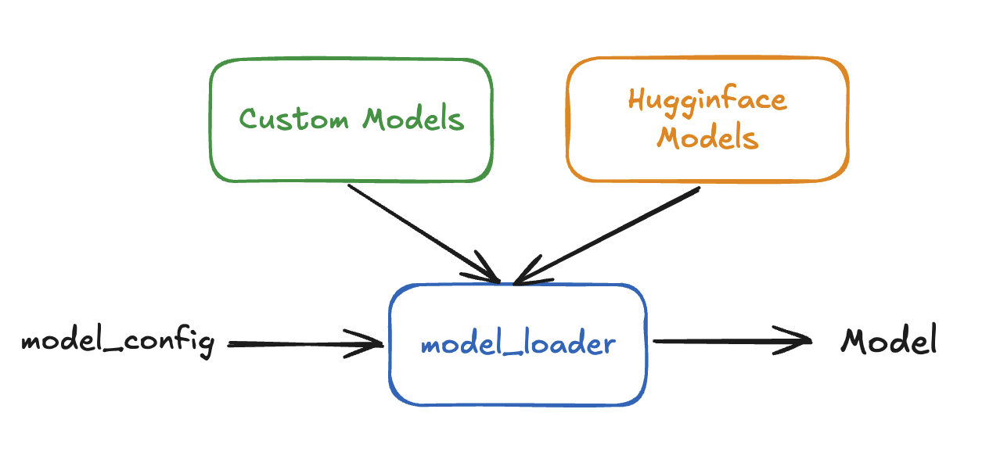

# Adding a New Model to VeOmni

## 🔖 Table of Contents

- [Adding a New Model to VeOmni](#adding-a-new-model-to-veomni)
  - [🔖 Table of Contents](#🔖-table-of-contents)
  - [📚 Overview](#📚-overview)
  - [🔍 Model Registry System](#🔍-model-registry-system)
  - [🛠️ Add Your Own Model](#🛠️-add-your-own-model)


## 📚 Overview
In this tutorial, we will guide you through the process of adding a new model to VeOmni. We use a registry-based system to manage different model implementations.

VeOmni uses a model registry system that allows you to:
1. Support both HuggingFace models and their custom implementations
2. Register your custom model implementation
3. Automatically load the appropriate model based on the configuration
 
## 🔍 Model Registry System

To enable users to quickly train models from HuggingFace and flexibly train custom models, VeOmni adopts a model registration system to support model loading and initialization. This design is inspired by [vLLM](https://github.com/vllm-project/vllm) and [SGLang](https://github.com/sgl-project/sglang). An overall architecture diagram is shown below.

<div style="text-align: center;">
    
</div>

Users can directly load models from HuggingFace and start the training process by specifying the model name or model path. Additionally, they can implement their own custom models or enhance existing HuggingFace models with advanced features such as sequence parallelism or expert parallelism. Custom modeling can be implemented in one of the supported modeling paths:

- `veomni/models/transformers/`
- `veomni/models/seed_omni/`


## 🛠️ Add Your Own Model

### 1. Create Your Model Implementation

First, create new modeling file for your model implementation. Note that the custom models should inherit from `PreTrainedModel` and implement the necessary methods.


### 2. Register Your Model

In your model implementation file, add a `ModelClass` variable that points to your model class:

```python
# At the end of your model file
ModelClass = YourCustomModel
```

Or if you want to register multiple model variants:

```python
ModelClass = [YourCustomModel, YourCustomModelVariant]
```


### 3. Model Configuration

Your model should have a corresponding configuration class that inherits from `PretrainedConfig`. The configuration should include:

```python
class YourCustomConfig(PretrainedConfig):
    model_type = "your_custom_model"
    architectures = ["YourCustomModel"]  # This should match your model class name
```

You can also use the model configuration from HuggingFace if you are only modifying the modeling component of an existing HuggingFace model.


Here's a complete example of adding a new model:

```python
# veomni/models/transformers/your_custom_model.py

from transformers import PreTrainedModel, PretrainedConfig

class YourCustomConfig(PretrainedConfig):
    model_type = "your_custom_model"
    architectures = ["YourCustomModel"]

class YourCustomModel(PreTrainedModel):
    config_class = YourCustomConfig
    
    def __init__(self, config):
        super().__init__(config)
        # Initialize your model components
        
    def forward(self, input_ids, **kwargs):
        ...

# Register your model
ModelClass = YourCustomModel
```

Check existing model implementations in the `veomni/models/transformers/` and `veomni/models/seed_omni/` directory for reference.

### 4. Loading Your Model

The framework will automatically handle model loading based on the configuration. You can load your model using:

```python
from veomni.models import build_foundation_model

model = build_foundation_model(
    config_path=args.model.config_path,
    weights_path=args.model.model_path,
    ...
)
```

VeOmni supports various initialization methods:

- Empty initialization
- Loading from weights file
- Meta device initialization
- Support for different devices (CUDA, CPU, NPU)