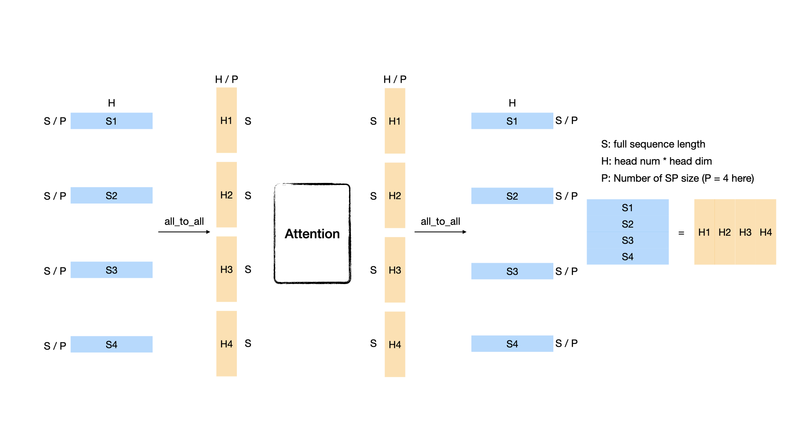
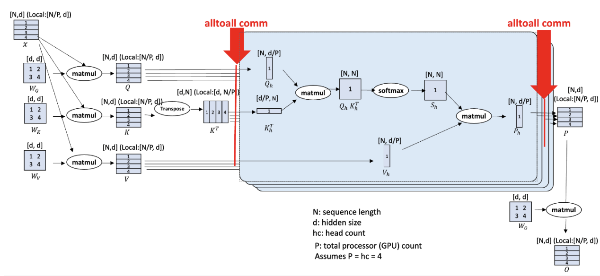

# VeOmni Long-Sequence Training Using Ulysses

## Table of Contents

- [VeOmni Long-Sequence Training Using Ulysses](#veomni-long-sequence-training-using-ulysses)
  - [Table of Contents](#table-of-contents)
  - [📚 Overview](#-overview)
  - [🚀 Quick Start](#-quick-start)
  - [🔍 Dive into Ulysses Sequence Parallelism](#-dive-into-ulysses-sequence-parallelism)
    - [What is all\_to\_all?](#what-is-all_to_all)
    - [DeepSpeed-Ulysses](#deepspeed-ulysses)
    - [Communication Analysis](#communication-analysis)
  - [⚙️ Core API](#️-core-api)
  - [🛠️ Support Ulysses for a New Model](#️-support-ulysses-for-a-new-model)

## 📚 Overview
In this tutorial, we introduce the implementation of DeepSpeed-Ulysses for efficient long-sequence training in VeOmni. The Ulysses method optimizes memory usage by splitting both the input tensor and intermediate activations along the sequence dimension. This innovative approach significantly enhances memory efficiency, enabling the training of models with longer sequence lengths.

Reference Paper: [DeepSpeed Ulysses: System Optimizations for Enabling Training of Extreme Long Sequence Transformer Models](https://arxiv.org/abs/2309.14509)

## 🚀 Quick Start
To enable Ulysses, users can specify the `ulysses_parallel_size` parameter in the configuration file or the launch command:

```shell
bash train.sh tasks/multimodal/omni/train_qwen2_5_vl.py configs/multimodal/qwen2_5_vl/qwen2_5_vl_fsdp1.yaml \
    --model.model_path YOUR_MODEL_PATH \
    --data.train_path YOUR_DATA_PATH \
    --train.ulysses_parallel_size 4
```

Currently, we have supported Ulysses on the following models:

Language models:
- LlaMa
- Qwen2.5

Multimodal models:
- Qwen2-VL
- Qwen2.5-VL

## 🔍 Dive into Ulysses Sequence Parallelism
Sequence Parallel (SP) serves as a prevalent strategy to handle long sequences that exceed the memory limit of a single GPU. Ulysses use all-to-all collective communication operations to implement SP with attention.

### What is all_to_all?

Suppose we have P GPUs and a sequence whose shape is [S, H], where N denotes the sequence length and d represents the hidden size (head num \* head dim). Each GPU initially holds the sequence's [S/P, H] partition. After performing an all_to_all communication, each GPU will get a head-splitting sequence whose shape is [S, H/P]. An illustration figure when P = 4 is as follows:

<div style="text-align: center;">
    
</div>

### DeepSpeed-Ulysses
We use the all_to_all based sequence parallelism which is proposed by DeepSpeed, named DeepSpeed-Ulysses.

<div style="text-align: center;">
    
</div>

(Image source: [DeepSpeed Ulysses: System Optimizations for Enabling Training of Extreme Long Sequence Transformer Models](https://arxiv.org/abs/2309.14509))

The figure above shows the overall architecture of DeepSpeed-Ulysses. It only introduces two extra all_to_all communications in the attention module while it does not modify other parts such as normalization and MLP. The input sequence is first evenly divided across the GPUs. The first all_to_all communication gathers the query, key, and value ([S/P, H]) along the sequence dimension and scatters the sequence in the head dimension ([S, H/P]). After the attention part, another all_to_all is performed to transfer the attention output ([S, H/P]) from head-sliced back to sequence-sliced ([S/P, H]). DeepSpeed-Ulysses is attention agnostic since it gathers the whole sequence dimension during attention computation. Thus, it can be easily used with FlashAttention. However, it is constrained by the number of attention heads since the sp size should be divided evenly by head_num. Note that DeepSpeed-Ulysses does not impact the memory consumed by the model states. To support large sequence-length training with a large language model, DeepSpeed-Ulysses can be integrated with ZeRO and FSDP.

### Communication Analysis
The communication volume transmitted per link for an all-to-all for aggregate message of size M over P GPUs can be estimated as $M(P-1)/P^2$. For a transformer model with hidden size H, the sequence length of S, and parallelism degree of P, and let $\mu = (P-1)/P$. DeepSpeed-Ulysses performs all-to-all for the QKV projections with an aggregate message size of $3SH$ before the attention computation, which introduces $3SH\mu/P$ communication volume; and another all-to-all for output context projection with a size Nh for each transformer layer, which introduces $SH\mu/P$ communication volume. Therefore, DeepSpeed sequence parallelism incurs an aggregate communication volume per link of $4SH\mu/P = 4M(P-1)/P^2$.

## ⚙️ Core API

1. gather_seq_scatter_heads

A method to do all-to-all before attention, make sure the sequence is full for attention score computation.

```Python
def gather_seq_scatter_heads(
    x: torch.Tensor,
    seq_dim: int,
    head_dim: int,
    unpadded_dim_size: int = 0,
    async_op: bool = False,
) -> Tensor
```

Args:
- x: tensor to be synced
- seq_dim: sequence dim that will be gathered
- head_dim: head dim that will be scattered. "head" is a concept from Multi-head Attention or Group Query Attention
- unpadded_dim_size: the full sequence size before padding and sharding
- async_op: if True, will return a torch._C._distributed_c10d.Work object, users can use this arg to do comm-compute overlap

2. gather_heads_scatter_seq

A method to do all-to-all after attention, transforming the activation from head-split to sequence-split.

```Python
def gather_heads_scatter_seq(
    x: torch.Tensor,
    head_dim: int,
    seq_dim: int
) -> Tensor
```

Args:
- x: Tensor to be synced
- head_dim: head dim that will be gathered
- seq_dim: sequence dim that will be scattered


3. reduce_sequence_parallel_loss

A method to reduce loss within the sequence parallel group, re-scale the loss according to the number of valid tokens.

```Python
def reduce_sequence_parallel_loss(
    loss: torch.Tensor,
    num_valid_tokens: torch.Tensor
) -> torch.Tensor
```

Args:
- loss: loss tensor to be reduced
- num_valid_tokens: the number of valid tokens in current rank

## 🛠️ Support Ulysses for a New Model

Typically, enabling Ulysses for a new model involves three key steps:

1. Create a sequence parallel group based on the specified Ulysses parallel size.
2. Shard input sequences across the sequence parallel groups.
3. Modify the model’s attention and loss computation to support Ulysses.

In VeOmni, the first two steps are automated. Users only need to specify the ulysses_parallel_size parameter, and VeOmni will handle the creation of sequence parallel groups and the sharding of input data. This allows users to focus solely on step 3—modifying the model’s architecture to implement Ulysses sequence parallelism.

To make this process easier, we provide an abstract pseudo-code example as a reference for implementing Ulysses in a new model:

```Python
from veomni.distributed.sequence_parallel import (
    gather_seq_scatter_heads_qkv,
    gather_heads_scatter_seq,
    reduce_sequence_parallel_loss,
)
# Step1: Create a sequence parallel group
# VeOmni will construct a sequence parllel group based on the parallel size

# Step2: Shard input sequences
# Suppose we get an input x of shape [batch_size, seq_len, dim]
# we first shard x among sequence parallel groups
# now x is of shape [batch_size, seq_len/n, dim] on each sp rank

# Step3 (part1): modify attention computation
x = self.qkv(x) # [batch_size, seq_pad/n, dim]
x = gather_seq_scatter_heads(x, seq_dim=1, head_dim=2) # [batch_size, seq_len, dim/n]
...
output = F.scaled_dot_product_attention(q, k, v, ...).reshape(...)
...
output = gather_heads_scatter_seq(output, head_dim=2, seq_dim=1) # [batch_size, seq_pad/n, dim]

# Step3 (part2): reduce loss after model forward
loss = loss_fct(logits, labels)
loss = reduce_sequence_parallel_loss(loss, num_valid_tokens)
return loss
```
